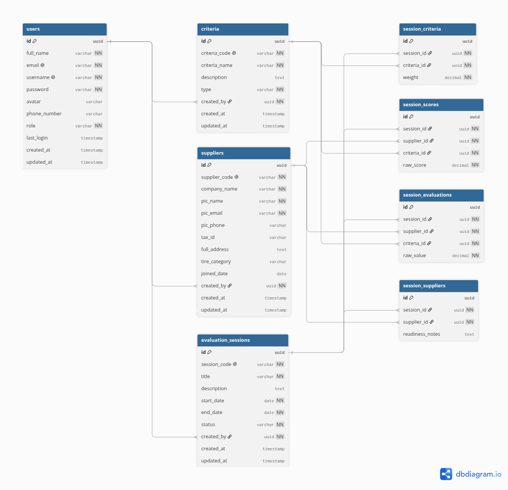

# SPK Pemilihan Supplier Ban (Native PHP Framework)

A web-based Decision Support System utilizing the **SMART** (Simple Multi Attribute Rating Technique) method for selecting airport tire suppliers. Built on a custom lightweight PHP MVC framework with **zero external dependencies** — no Composer, no third-party packages.

---

## Features

- **Dashboard Eksekutif**: Ringkasan data statistik dan aktivitas terbaru dalam satu tampilan.
- **Manajemen Master Data**: CRUD untuk Supplier Ban Bandara dan Kriteria Penilaian (dengan penentuan bobot & tipe Benefit/Cost).
- **Manajemen User**: Sistem autentikasi dan peran pengguna (Admin, Staff, Pimpinan).
- **Sesi Penilaian (SPK)**: Pembuatan sesi evaluasi menggunakan form Wizard/Stepper.
- **Mesin Perhitungan SMART**: Kalkulasi otomatis nilai utility, normalisasi bobot, dan perankingan hasil akhir secara transparan di layar.
- **UI/UX Modern**: Dibangun menggunakan template Metronic (Bootstrap 5).

---

## Prerequisites

- **PHP 8.1** or higher
- **PDO extension** enabled (`php-pdo`)
- **MySQL** (recommended) or **PostgreSQL**
- Database driver extension (`php-mysql` or `php-pgsql`)

---

## Initialization & Setup

### Step 1: Clone the Repository

```bash
git clone <repository-url> spk-smart
cd spk-smart
```

### Step 2: Configure Environment

Copy the example environment file and edit your database credentials:

```bash
cp .env.example .env
```

Edit `.env` with your database settings:

```env
DB_CONNECTION=mysql
DB_HOST=127.0.0.1
DB_PORT=3306
DB_NAME=spk_smart
DB_USER=root
DB_PASS=root
```

- Set `DB_CONNECTION` to `mysql` or `pgsql` depending on your database.
- Create the database (`spk_smart` in the example above) before running migrations.

### Step 3: Run Migrations

```bash
php migrate.php
```

This creates all required tables: `users`, `criteria`, `suppliers`, `evaluation_sessions`, `session_criteria`, `session_suppliers`, `session_scores`, and `session_evaluations`.

### Step 4: Run Seeders

```bash
php seed.php
```

This command populates the database with initial dummy data for **Users**, **Suppliers**, and **Criteria**, so you can start using the application immediately.

### Step 5: Start Development Server

```bash
php -S localhost:8080 -t public/
```

Open `http://localhost:8080` in your browser.

---

## Default Login Credentials

The following accounts are automatically created after running `php seed.php`:

| Role | Username | Password |
|------|----------|----------|
| Admin | `admin` | `Qwerty123*` |
| Staff | `staff` | `Qwerty123*` |
| Pimpinan | `pimpinan` | `Qwerty123*` |

---

## Available CLI Commands

| Command | Description |
|---------|-------------|
| `php migrate.php` | Execute all pending database migrations in a transaction. Tracks executed migrations to avoid duplicates. |
| `php make_migration.php <name>` | Generate a new timestamped migration file boilerplate in `database/migrations/`. Example: `php make_migration.php create_products_table` |
| `php seed.php` | Execute all seeders in `database/seeders/` to populate the database with initial dummy data. |

---

## Architecture Reference

This project is built on a custom native PHP MVC semi-framework. For deep technical specifications covering the core engine — including the custom PSR-4 Autoloader, Router, Query Builder, dual-database PDO layer, .env parser, and migration system — refer to the blueprint document:

**[`codebase.md`](codebase.md)**

---

## Database Schema

Berikut adalah diagram Entity Relationship (ERD) yang menggambarkan struktur database sistem SPK Pemilihan Supplier Ban Bandara:



### Penjelasan Skema

Database terdiri dari **8 tabel utama** yang saling terhubung melalui foreign key:

- **`users`** — Menyimpan data pengguna sistem dengan peran (admin, staff, pimpinan).
- **`criteria`** — Master data kriteria penilaian SMART (contoh: Harga, Kualitas) beserta tipe Benefit/Cost.
- **`suppliers`** — Master data supplier ban bandara lengkap dengan informasi PIC dan alamat.
- **`evaluation_sessions`** — Sesi evaluasi SPK yang mencakup periode waktu dan status (draft → berlangsung → selesai).
- **`session_criteria`** — Relasi many-to-many antara sesi dan kriteria, menyimpan bobot kustom per sesi.
- **`session_suppliers`** — Relasi many-to-many antara sesi dan supplier yang dipilih untuk dievaluasi.
- **`session_scores`** — Tabel legacy untuk menyimpan skor mentah (opsional).
- **`session_evaluations`** — Menyimpan nilai evaluasi mentah (raw value) setiap supplier pada setiap kriteria dalam satu sesi.

Semua tabel menggunakan **UUID** sebagai primary key untuk mendukung skalabilitas dan keamanan distribusi data.

---

## Project Structure

```
/
├── app/
│   ├── Controllers/          # Application controllers (Auth, Criteria, Dashboard, Profile, Session, Supplier, User)
│   ├── Middleware/            # AuthMiddleware
│   └── Models/              # Application models (User)
├── core/                     # Framework engine (Autoload, Router, DB, Request, Response, Session, UUID, etc.)
├── database/
│   ├── migrations/           # Database migration files
│   └── seeders/              # Database seeders (User, Criteria, Supplier)
├── public/
│   ├── assets/              # Static assets (CSS, JS, images)
│   ├── uploads/             # User uploads
│   └── index.php            # Application entry point & routes
├── views/                    # PHP view templates
│   ├── auth/                # Login, Profile
│   ├── criteria/            # Kriteria CRUD
│   ├── dashboard/           # Dashboard index
│   ├── layouts/             # Master, Footer, Sidebar
│   ├── sessions/            # Sesi: index, create, input, result
│   ├── suppliers/           # Supplier CRUD
│   └── users/               # User management
├── .env                      # Environment configuration (gitignored)
├── .env.example              # Environment template
├── .gitignore                # Git ignore rules
├── codebase.md               # Technical blueprint
├── make_migration.php        # Migration generator
├── migrate.php               # Migration runner
├── reset_database.php        # Database reset script
└── README.md
```

---

## License

This project is for internal/academic use.
